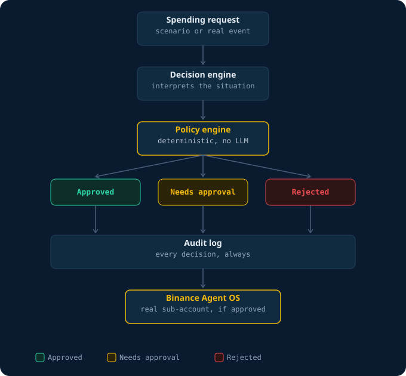

# Binamaris

An autonomous treasury agent for a single vessel. It manages operating
funds against fixed reserve floors and spending limits, executes routine
decisions on its own through Binance Agent OS, and stops to ask a human
the moment a request falls outside policy.

Built for the Binance Agent OS Mini Hackathon.

## The idea

Most agent demos show an AI doing more. Binamaris is built around the
opposite idea: an AI that knows exactly what it is not allowed to do.

A ship's treasury has hard constraints. Fuel and crew reserves cannot be
drawn below a safety minimum. An emergency reserve exists to be used for
emergencies, not convenience. Some decisions are routine and should not
need a human. Others are large enough, or risky enough, that a human has
to see them before money moves.

Binamaris encodes those constraints as deterministic, testable code, not
as instructions to a language model. The policy engine has no LLM call in
it at all. It is pure functions: same input, same output, every time.
That is what makes the reserve floors and limits auditable rather than
merely plausible.

## What's implemented

- **The policy engine and its 5 tests**: deterministic, no
  mocked logic. See `policies/maritime-policy.ts` and
  `policies/maritime-policy.test.ts`.
- **The audit log**: every decision is appended to
  `audit/log.ndjson`, append-only, in the format it was actually
  generated in, not reformatted for the demo.
- **The vessel**: Binamaris tracks the container ship EVER GIVEN
  (IMO 9811000, MMSI 353136000) via live AIS data from aisstream.io. The
  position shown on the bridge is wherever that ship is right
  now.
- **The treasury figures**: modeled from industry reserve
  ranges, not pulled from any shipping company's accounts,
  since that data is privately held and not publicly available.
  This is stated plainly rather than presented as something it is not.
- **The Binance Agent OS execution**: approved actions are carried out
  through a funded Binance Agentic sub-account, not simulated
  after the fact. See the Demo section below for how this is triggered.

## Architecture



The agent's job is to interpret a situation and hand it to the policy
engine. The policy engine's job is to say yes, no, or "ask a person." The
agent never overrides that answer.

## Running it

```bash
npm install
npm test
npm run dev
```

Then open the app. `/` is the landing page, `/console` is the working
bridge dashboard.

You will need a `.env.local` file (not committed, see `.env.example` for
the shape) with:

- `AISSTREAM_API_KEY`: free key from https://aisstream.io
- `VESSEL_MMSI`: set to `353136000` to track EVER GIVEN, or another
  vessel's MMSI to track a different ship

## Demo

From the bridge console:

1. Watch the Vessel panel pick up a live position report for EVER GIVEN.
2. Run the "Routine engine maintenance" scenario: approved
   autonomously, within reserve and limit.
3. Run "Unscheduled hull repair": exceeds the autonomous transaction
   limit, escalates to human approval required.
4. Run "Draw on emergency reserve below its protected floor": rejected,
   the reserve floor is protected even though the amount is small and
   within the transaction limit.
5. Check the Audit log: every one of the above is recorded there as it
   happens, not reconstructed afterward.

## What this is not

This is a single-vessel prototype built in one week. It does not have
multi-tenant accounts, billing, or a production-grade auth system. The
"Milestones" section on the landing page states plainly what is running
now versus what a fleet-operator version would need next.

## License

MIT
